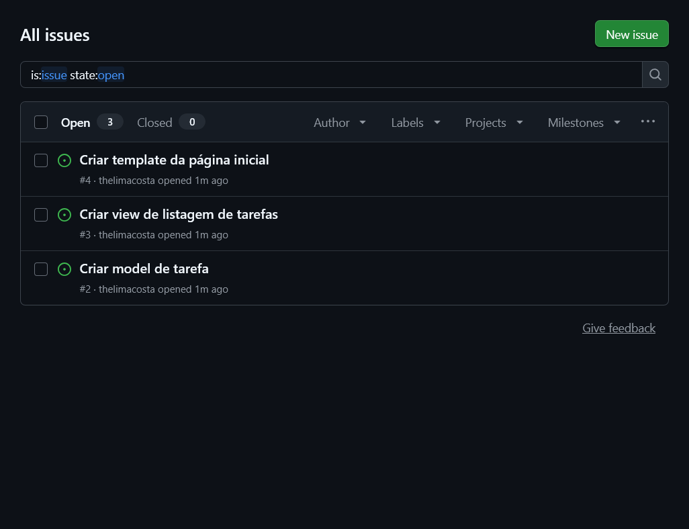
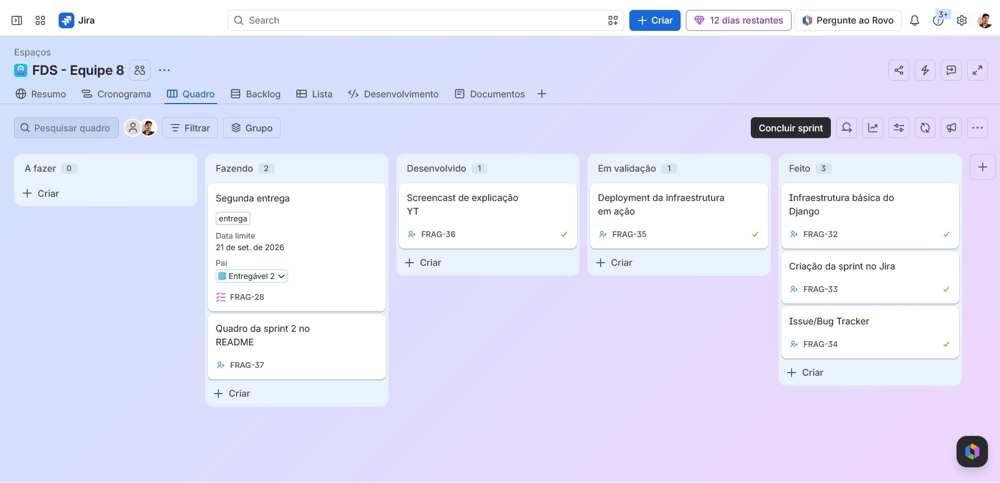

# Projeto de Tarefas — Grupo 13 (Projetos 2)

## Descrição do projeto

Sistema de gerenciamento de tarefas, desenvolvido em Django como parte da disciplina de Projetos 2.

## Tecnologias utilizadas

- Python
- Django
- SQLite (banco de dados local)

## Como rodar o projeto

### Pré-requisitos

- Python 3.x instalado

### Passos

```
git clone https://github.com/LopesLuna/Projeto-2.git
cd Projeto-2
python -m venv venv
venv\Scripts\activate
pip install -r requirements.txt
python manage.py migrate
python manage.py runserver
```

Depois, acesse http://127.0.0.1:8000/

## Deploy

A aplicação está publicada em produção no Render:

**URL de acesso:** https://projeto-2-tarefas.onrender.com

Basta acessar o link acima para ver o sistema funcionando (nenhuma instalação necessária).

## Screencasts

- **Uso do sistema:** https://youtu.be/3Cm4KoyMyjQ
- **Explicação do código:** https://youtu.be/5OAqTvpYoJA

## Issue Tracker

Utilizamos o GitHub Issues para rastrear as tarefas do desenvolvimento.

[Ver issues](https://github.com/LopesLuna/Projeto-2/issues)



## Entregas

### Entrega 01

### Entrega 02

**Descrição:** Implementação da infraestrutura básica da aplicação Django (model, view, template e rotas de tarefas, incluindo cadastro de novas tarefas), deploy em produção no Render, e configuração do Issue Tracker no GitHub.

**Artefatos / screenshots:**

- Deploy: https://projeto-2-tarefas.onrender.com
- Screencast de uso: https://youtu.be/3Cm4KoyMyjQ
- Screencast do código: https://youtu.be/5OAqTvpYoJA

**Quadro da Sprint 02:**



## Equipe

| Nome completo | E-mail School |
|---|---|
| [Nome do membro 1] | [email] |
| [João Bezerra] | [email] |
| [José Ernesto] | [email] |
| [Mariana Luna] | [email] |
| Matheus Costa | mplc@cesar.school |
| [Pedro Correia] | [email] |
| Rodrigo Fernandes | rfvb@cesar.school |
